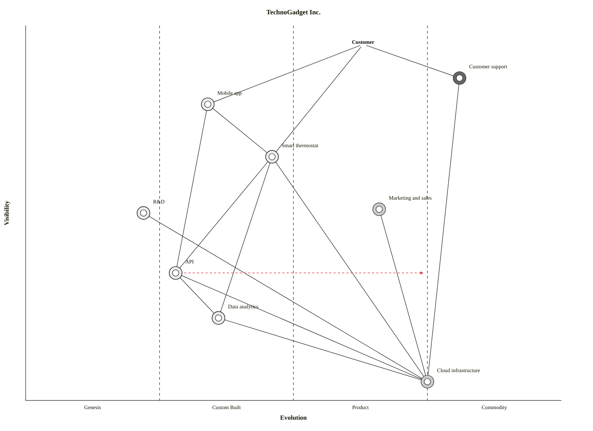

# Mermaid Wardley Dual Output Implementation Plan

> **For agentic workers:** REQUIRED: Use superpowers:subagent-driven-development (if subagents available) or superpowers:executing-plans to implement this plan. Steps use checkbox (`- [ ]`) syntax for tracking.

**Goal:** Add Mermaid `wardley-beta` output as a secondary collapsible block alongside the existing OnlineWardleyMaps (OWM) syntax in Wardley map artifacts.

**Architecture:** Template-driven approach — add `<details>` blocks to 2 templates, update 2 commands with Mermaid generation instructions (including decorator mapping and pipeline translation rules), update 2 guides with viewing guidance, and add Mermaid reference examples. The converter propagates changes to all 4 extension formats automatically.

**Tech Stack:** Markdown templates, YAML frontmatter commands, Mermaid `wardley-beta` syntax, `scripts/converter.py`

**Spec:** `docs/superpowers/specs/2026-03-17-mermaid-wardley-dual-output-design.md`

---

## File Map

| File | Action | Responsibility |
|------|--------|---------------|
| `arckit-claude/templates/wardley-map-template.md` | Edit | Add Mermaid `<details>` block with decorator placeholders |
| `.arckit/templates/wardley-map-template.md` | Edit | Mirror of plugin template |
| `arckit-claude/templates/wardley-value-chain-template.md` | Edit | Add Mermaid `<details>` block without decorators |
| `.arckit/templates/wardley-value-chain-template.md` | Edit | Mirror of plugin template |
| `arckit-claude/commands/wardley.md` | Edit | Add Mermaid syntax reference, decorator rules, example |
| `arckit-claude/commands/wardley.value-chain.md` | Edit | Add Mermaid syntax reference (no decorators) |
| `docs/guides/wardley.md` | Edit | Add Mermaid viewing guidance |
| `docs/guides/wardley-value-chain.md` | Edit | Add Mermaid viewing guidance |
| `arckit-claude/skills/wardley-mapping/references/mapping-examples.md` | Edit | Add Mermaid examples with decorators |

---

### Task 1: Add Mermaid block to Wardley Map template (plugin)

**Files:**
- Modify: `arckit-claude/templates/wardley-map-template.md:53-55`

- [ ] **Step 1: Read the template to confirm exact insertion point**

Read `arckit-claude/templates/wardley-map-template.md` lines 50-57. The OWM code fence closes with ` ``` ` at line 53, followed by `---` at line 55. Insert between them. Note: there is a separate Mermaid `flowchart TD` block at line 341 for dependency diagrams — leave that unchanged.

- [ ] **Step 2: Insert the Mermaid `<details>` block after line 53**

After the closing ` ``` ` of the OWM block (line 53), before the `---` (line 55), insert:

```markdown

<details>
<summary>Mermaid Wardley Map (renders in GitHub, VS Code, and other Mermaid-enabled viewers)</summary>

> **Note**: Mermaid Wardley Maps use the `wardley-beta` keyword. This feature is in Mermaid's develop branch and may not render in all viewers yet.


**Decorator Guide**:
- `(build)` — Genesis/Custom components built in-house (triangle marker)
- `(buy)` — Product/Commodity components procured from market (diamond marker)
- `(outsource)` — Components outsourced to vendors (square marker)
- `(inertia)` — Components with resistance to change (vertical line)

</details>

```

- [ ] **Step 3: Verify template renders correctly**

Open the template in VS Code preview or view on GitHub to confirm:
- OWM block is still visible and unchanged
- `<details>` block appears collapsed below the OWM block
- Expanding it shows the Mermaid code block and decorator guide

- [ ] **Step 4: Commit**

```bash
git add arckit-claude/templates/wardley-map-template.md
git commit -m "feat: add Mermaid wardley-beta block to wardley map template"
```

---

### Task 2: Mirror template change to CLI copy

**Files:**
- Modify: `.arckit/templates/wardley-map-template.md:53-55`

- [ ] **Step 1: Copy the plugin template to the CLI mirror**

```bash
cp arckit-claude/templates/wardley-map-template.md .arckit/templates/wardley-map-template.md
```

- [ ] **Step 2: Verify files are identical**

```bash
diff arckit-claude/templates/wardley-map-template.md .arckit/templates/wardley-map-template.md
```

Expected: no output (files identical).

- [ ] **Step 3: Commit**

```bash
git add .arckit/templates/wardley-map-template.md
git commit -m "feat: mirror Mermaid block to CLI wardley map template"
```

---

### Task 3: Add Mermaid block to Value Chain template (plugin)

**Files:**
- Modify: `arckit-claude/templates/wardley-value-chain-template.md:109-112`

- [ ] **Step 1: Read the template to confirm exact insertion point**

Read `arckit-claude/templates/wardley-value-chain-template.md` lines 107-114. The OWM code fence closes with ` ``` ` at line 110, followed by `---` at line 112. Insert between them.

- [ ] **Step 2: Insert the Mermaid `<details>` block after line 110**

After the closing ` ``` ` of the OWM block (line 110), before the `---` (line 112), insert:

```markdown

<details>
<summary>Mermaid Value Chain Map (renders in GitHub, VS Code, and other Mermaid-enabled viewers)</summary>

> **Note**: Mermaid Wardley Maps use the `wardley-beta` keyword. This feature is in Mermaid's develop branch and may not render in all viewers yet. No sourcing decorators at the value chain stage — those are added when creating the full Wardley Map.


</details>

```

- [ ] **Step 3: Commit**

```bash
git add arckit-claude/templates/wardley-value-chain-template.md
git commit -m "feat: add Mermaid wardley-beta block to value chain template"
```

---

### Task 4: Mirror value chain template change to CLI copy

**Files:**
- Modify: `.arckit/templates/wardley-value-chain-template.md:109-112`

- [ ] **Step 1: Copy the plugin template to the CLI mirror**

```bash
cp arckit-claude/templates/wardley-value-chain-template.md .arckit/templates/wardley-value-chain-template.md
```

- [ ] **Step 2: Verify files are identical**

```bash
diff arckit-claude/templates/wardley-value-chain-template.md .arckit/templates/wardley-value-chain-template.md
```

Expected: no output (files identical).

- [ ] **Step 3: Commit**

```bash
git add .arckit/templates/wardley-value-chain-template.md
git commit -m "feat: mirror Mermaid block to CLI value chain template"
```

---

### Task 5: Update wardley command with Mermaid generation instructions

**Files:**
- Modify: `arckit-claude/commands/wardley.md:220,413-416,578`

This task has 3 edits to the same file.

- [ ] **Step 1: Read the file to confirm insertion points**

Read `arckit-claude/commands/wardley.md` lines 218-232 (after "Map Code Generation" section, before "Strategic Analysis"). Also read lines 411-417 (Output Contents bullet 2) and lines 576-580 (end of OWM example).

- [ ] **Step 2 (Edit A): Add Mermaid syntax reference after line 230**

After the `**Syntax Rules**:` block which ends around line 230 (after the line about `pipeline`), before `### Strategic Analysis`, insert:

```markdown

### Mermaid Wardley Map (Enhanced)

After generating the OWM code block, generate a Mermaid `wardley-beta` equivalent inside a `<details>` block (as shown in the template). The Mermaid version adds sourcing strategy decorators derived from the Build vs Buy analysis:

- Components with evolution < 0.50 that are strategic differentiators: `(build)`
- Components procured from market (Product stage): `(buy)`
- Components outsourced to vendors: `(outsource)`
- Commodity/utility components: no decorator (or `(buy)` if via G-Cloud/marketplace)
- Components with identified inertia: append `(inertia)`

**Pipeline translation**: Convert OWM `pipeline Name [vis, evo_start, evo_end]` to Mermaid's named-child format where pipeline variants are identified:

```text
pipeline Parent {
  component "Variant A" [evo_a]
  component "Variant B" [evo_b]
}
```

**Syntax differences from OWM** (apply these when translating):

- Start with `wardley-beta` keyword (not `style wardley` at end)
- Add `size [1100, 800]` after title
- Wrap note text in double quotes: `note "text" [vis, evo]`
- Annotations use comma separator: `annotation N,[vis, evo] "text"`
- Add `annotations [0.05, 0.05]` to position the annotation list
- Remove `style wardley` line
- Remove the `label` keyword and any text after the target evolution number on `evolve` lines (Mermaid does not support evolve labels)
- Use ` ```mermaid ` as the code fence language identifier (not ` ```wardley-beta ` or ` ```text `)

```

- [ ] **Step 3 (Edit B): Update Output Contents bullet 2**

Replace lines 413-416:

```markdown
2. **Map Visualization Code**:
   - Complete Wardley Map in OnlineWardleyMaps syntax
   - URL: https://create.wardleymaps.ai
   - Instructions to paste code into create.wardleymaps.ai
```

With:

```markdown
2. **Map Visualization Code**:
   - Complete Wardley Map in OnlineWardleyMaps syntax (primary)
   - URL: https://create.wardleymaps.ai
   - Instructions to paste code into create.wardleymaps.ai
   - Mermaid `wardley-beta` equivalent in collapsible `<details>` block with sourcing decorators (`build`/`buy`/`outsource`/`inertia`)
```

- [ ] **Step 4 (Edit C): Add Mermaid example after OWM example**

After line 578 (`style wardley` followed by closing ` ``` `), insert:

```markdown

<details>
<summary>Mermaid Wardley Map</summary>


</details>

```

- [ ] **Step 5: Commit**

```bash
git add arckit-claude/commands/wardley.md
git commit -m "feat: add Mermaid wardley-beta generation instructions to wardley command"
```

---

### Task 6: Update wardley.value-chain command with Mermaid instructions

**Files:**
- Modify: `arckit-claude/commands/wardley.value-chain.md:309,326`

- [ ] **Step 1: Read the file to confirm insertion points**

Read `arckit-claude/commands/wardley.value-chain.md` lines 305-330. Bullet 3 ("Value Chain Diagram") is at lines 307-309. The Output Contents section continues through line 326.

- [ ] **Step 2 (Edit A): Add Mermaid subsection after bullet 3**

After line 309 (`   - Complete OWM syntax for https://create.wardleymaps.ai`), insert:

```markdown
   - Mermaid `wardley-beta` equivalent in collapsible `<details>` block (no sourcing decorators at value chain stage)

### Mermaid Value Chain Map

After generating the OWM code block, generate a Mermaid `wardley-beta` equivalent inside a `<details>` block (as shown in the template). At the value chain stage, no sourcing decorators are used (build/buy analysis has not been performed yet).

**Syntax differences from OWM** (apply these when translating):

- Start with `wardley-beta` keyword (not `style wardley` at end)
- Add `size [1100, 800]` after title
- Wrap note text in double quotes: `note "text" [vis, evo]`
- Remove `style wardley` line
- Use ` ```mermaid ` as the code fence language identifier

```

- [ ] **Step 3: Commit**

```bash
git add arckit-claude/commands/wardley.value-chain.md
git commit -m "feat: add Mermaid wardley-beta generation instructions to value chain command"
```

---

### Task 7: Update wardley guide with viewing guidance

**Files:**
- Modify: `docs/guides/wardley.md:147`

- [ ] **Step 1: Read the file to confirm insertion point**

Read `docs/guides/wardley.md` lines 144-150. The "OnlineWardleyMaps Format" section ends at line 147 with `Visualize at: https://create.wardleymaps.ai`. Insert a new section after line 149 (the `---` separator).

- [ ] **Step 2: Add "Viewing Your Map" section after line 149**

After the `---` at line 149, before `## Key Principles` at line 151, insert:

```markdown

## Viewing Your Map

**OnlineWardleyMaps** (primary): Copy the `wardley` code block and paste into [https://create.wardleymaps.ai](https://create.wardleymaps.ai) for an interactive editor with drag-and-drop repositioning.

**Mermaid** (secondary): Expand the `<details>` block in your generated artifact to see the Mermaid `wardley-beta` equivalent. This will render inline in GitHub, VS Code, and other Mermaid-enabled viewers once Mermaid ships `wardley-beta` in a stable release. The Mermaid version includes sourcing strategy markers (`build`/`buy`/`outsource`/`inertia`) as visual decorators on each component.

---

```

- [ ] **Step 3: Commit**

```bash
git add docs/guides/wardley.md
git commit -m "docs: add Mermaid viewing guidance to wardley guide"
```

---

### Task 8: Update value chain guide with viewing guidance

**Files:**
- Modify: `docs/guides/wardley-value-chain.md:116`

- [ ] **Step 1: Read the file to confirm insertion point**

Read `docs/guides/wardley-value-chain.md` lines 114-122. The "Tips" section ends at line 116. Insert before "Feeds Into" section.

- [ ] **Step 2: Add "Viewing Your Map" section after line 117 (the `---`)**

After the `---` at line 117, before `## Feeds Into` at line 119, insert:

```markdown

## Viewing Your Map

**OnlineWardleyMaps** (primary): Copy the `wardley` code block and paste into [https://create.wardleymaps.ai](https://create.wardleymaps.ai) for an interactive editor.

**Mermaid** (secondary): Expand the `<details>` block in your generated artifact to see the Mermaid `wardley-beta` equivalent. This will render inline in GitHub, VS Code, and other Mermaid-enabled viewers once Mermaid ships `wardley-beta` in a stable release. Value chain maps do not include sourcing decorators — those are added by `/arckit.wardley` when creating the full positioned map.

---

```

- [ ] **Step 3: Commit**

```bash
git add docs/guides/wardley-value-chain.md
git commit -m "docs: add Mermaid viewing guidance to value chain guide"
```

---

### Task 9: Add Mermaid examples to mapping-examples reference

**Files:**
- Modify: `arckit-claude/skills/wardley-mapping/references/mapping-examples.md:355-358`

- [ ] **Step 1: Read the file to confirm insertion point**

Read `arckit-claude/skills/wardley-mapping/references/mapping-examples.md` lines 319-378. Example 4 (TechnoGadget) has OWM syntax at lines 321-355 followed by `Paste into [OnlineWardleyMaps]` at line 357. This is the best example to add a Mermaid equivalent to because it has concrete component positions and an evolve annotation.

- [ ] **Step 2: Add Mermaid equivalent after the OWM block**

After line 357 (`Paste into [OnlineWardleyMaps](https://create.wardleymaps.ai) to render.`), insert:

```markdown

<details>
<summary>Mermaid Wardley Map (with sourcing decorators)</summary>



</details>

```

- [ ] **Step 3: Add Mermaid equivalent for Example 5 (Value Chain Decomposition)**

Read lines 380-482. Example 5 is a value chain walkthrough. After the validation checklist block ending at line 480, before the `---` at line 482, add a note:

```markdown

> **Mermaid equivalent**: When generating value chain maps, the `wardley-beta` Mermaid block uses the same coordinates but omits sourcing decorators (build/buy analysis happens in the subsequent `/arckit.wardley` step). See the value chain template for the Mermaid placeholder format.

```

- [ ] **Step 4: Commit**

```bash
git add arckit-claude/skills/wardley-mapping/references/mapping-examples.md
git commit -m "docs: add Mermaid wardley-beta examples to mapping references"
```

---

### Task 10: Run converter and verify extension propagation

**Files:**
- Run: `scripts/converter.py`
- Verify: `arckit-gemini/commands/arckit/wardley*.toml`, `arckit-codex/skills/arckit-wardley*/SKILL.md`, `arckit-opencode/commands/arckit.wardley*.md`, `arckit-copilot/prompts/arckit-wardley*.prompt.md`

- [ ] **Step 1: Run the converter**

```bash
python scripts/converter.py
```

Expected: Converter processes all commands including the modified `wardley.md` and `wardley.value-chain.md`, generating updated output in all 4 extension directories.

- [ ] **Step 2: Verify `<details>` HTML survives Gemini TOML conversion**

```bash
grep -l '<details>' arckit-gemini/commands/arckit/wardley*.toml
```

Expected: Should list `wardley.toml` and `wardley.value-chain.toml` (the TOML triple-quoted strings preserve HTML tags).

- [ ] **Step 3: Verify Mermaid instructions appear in Codex skills**

```bash
grep -l 'wardley-beta' arckit-codex/skills/arckit-wardley/SKILL.md arckit-codex/skills/arckit-wardley-value-chain/SKILL.md
```

Expected: Both files should match (Mermaid syntax reference propagated).

- [ ] **Step 4: Verify Mermaid instructions appear in OpenCode commands**

```bash
grep -l 'wardley-beta' arckit-opencode/commands/arckit.wardley.md arckit-opencode/commands/arckit.wardley.value-chain.md
```

Expected: Both files should match.

- [ ] **Step 5: Verify Mermaid instructions appear in Copilot prompts**

```bash
grep -l 'wardley-beta' arckit-copilot/prompts/arckit-wardley.prompt.md arckit-copilot/prompts/arckit-wardley-value-chain.prompt.md
```

Expected: Both files should match.

- [ ] **Step 6: Commit all converter output**

```bash
git add arckit-codex/ arckit-opencode/ arckit-gemini/ arckit-copilot/ .codex/ .opencode/
git commit -m "chore: regenerate extension formats with Mermaid wardley-beta support"
```

---

### Task 11: Final verification

- [ ] **Step 1: Verify no untracked files remain**

```bash
git status
```

Expected: Clean working tree, all changes committed.

- [ ] **Step 2: Verify the spec is satisfied**

Review each design decision from the spec:

- OWM remains primary (check: OWM code block is above `<details>` in templates) ✅
- Mermaid uses sourcing decorators in wardley command (check: `(build)`, `(buy)`, `(outsource)`, `(inertia)` in command instructions) ✅
- Value chain has no decorators (check: value chain command says "no sourcing decorators") ✅
- Pipelines translated to named-child format (check: pipeline example in wardley command) ✅
- Mermaid in collapsible `<details>` block (check: templates use `<details>`) ✅
- Validation hook unchanged (check: `validate-wardley-math.mjs` not modified) ✅
- Only wardley + wardley.value-chain touched (check: doctrine/climate/gameplay unchanged) ✅

- [ ] **Step 3: Run markdown lint**

```bash
npx markdownlint-cli2 "arckit-claude/templates/wardley-map-template.md" "arckit-claude/templates/wardley-value-chain-template.md" "arckit-claude/commands/wardley.md" "arckit-claude/commands/wardley.value-chain.md" "docs/guides/wardley.md" "docs/guides/wardley-value-chain.md"
```

Fix any lint violations, commit if needed.
